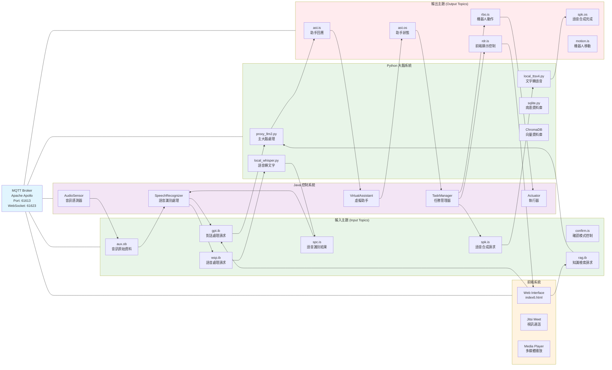

# 5G AMR LLM 護理機器人系統

## 專案概述

這是一個基於 5G 技術的智能護理機器人系統，結合了自主移動機器人（AMR）和大型語言模型（LLM）技術。系統主要用於醫療護理環境中，提供病患照護、醫療問答、衛生教育和任務執行等功能。

## 系統架構

### 核心組件

1. **Java 控制系統** (`AMR_LLM/`)
   - 主程式：`AMR_LLM.java`
   - 任務管理：`TaskManager.java`
   - 感測器模組：`AudioSensor.java`
   - 執行器模組：`Actuator.java`
   - 語音識別：`SpeechRecognizer.java`
   - 虛擬助手：`VirtualAssistant.java`
   - 機器人控制：`Avatar.java`

2. **Python 大腦系統** (`pythonWhisper/`)
   - 主程式：`proxy_llm2.py`
      - 醫療知識查詢：RAGFlow 整合
   - 向量資料庫：`testChromaDB3.py`
   - 病患資料管理：`sqlite.py`
   - 【未啟用】文字轉語音：`local_ttsx4.py`
   - 【未完成】語音轉文字：`local_whisper.py`
   

3. **前端介面系統** (`AMR_LLM/assets/`)
   - 主頁面：`index6.html`
   - 樣式設計：`style6.css`
   - 核心邏輯：`script6.js`
      - 含任務管理：`task-list-base.js`
      - MQTT 通信：`mqttws31.js`
      - 視訊通話：`external_api.js` (Jitsi)

4. **通信系統 (MQTT架構)**
   - **MQTT Broker** (Apache Apollo、port = 61613、WebSocket = 61623)
   
   **主題分類架構**：
   
   **音訊處理主題**：
   - `aux.ob` - 音訊原始資料 (AudioSensor → SpeechRecognizer)
   - `aux.is` - 音訊控制指令 (AudioSensor 訂閱)
   - (?)`aux.cmds` - 音訊命令 (AudioSensor 訂閱)
   - (?)`aux.vols` - 音量控制 (AudioSensor 訂閱)
   - (?)`aux.sils` - 靜音控制 (AudioSensor 訂閱)
   
   **語音識別主題**：
   - `spc.is` - 語音識別結果 (Python → SpeechRecognizer)
   - (?)`spc.txls` - 語音文字限制設定 (SpeechRecognizer 訂閱)
   - (?)`wsp.ib` - 語音處理請求 (SpeechRecognizer → Whisper)
   
   **對話處理主題**：
   - `gpt.ib` - 對話處理請求 (Java → Python 大腦)
   - `rag.ib` - 知識檢索請求 (Java → Python 大腦)
   - `ast.is` - 助手回應 (Python → VirtualAssistant)
   - `ast.os` - 助手狀態 (VirtualAssistant → TaskManager)
   
   **任務管理主題**：
   - (?)`tsm.is` - 任務管理指令 (TaskManager 訂閱)
   - `confirm.is` - 確認模式控制 (多組件共用)
   - `sql_update.is` - 資料庫更新通知 (TaskManager 訂閱)
   
   **執行控制主題**：
   - `rdr.is` - 前端顯示控制 (TaskManager → Actuator → Frontend)
   - `rdr.os` - 前端狀態回饋 (TaskManager、Actuator 訂閱)
   - `spk.is` - 語音合成請求 (TaskManager → TTS)
   - `spk.os` - 語音合成完成 (TaskManager、Actuator 訂閱)
   - `rbo.is` - 機器人動作指令 (TaskManager → Actuator)
   - `rbo.os` - 機器人狀態回饋 (TaskManager、Actuator 訂閱)
   - `motion.is` - 機器人移動控制 (Actuator → Robot)
   - `motion.os` - 機器人移動狀態 (Actuator 訂閱)
   - `tts.is` - TTS 系統指令 (Task → TTS)
   
   **系統同步主題**：
   - (?)`sync.request` - 系統同步請求 (Python 大腦訂閱)
   
   **資料流向**：
   ```
   音訊輸入 → aux.ob → 語音識別 → spc.is → 對話處理 → gpt.ib → 
   AI大腦 → ast.is → 虛擬助手 → ast.os → 任務管理 → 
   執行分發 → [rdr.is, spk.is, rbo.is] → 各執行器 → 狀態回饋
   ```

   **組件 MQTT 訂閱/發布對照表**：
   
   | 組件 | 訂閱主題 (Subscribe) | 發布主題 (Publish) |
   |------|---------------------|-------------------|
   | **AudioSensor** | `aux.is`, `aux.cmds`, `aux.vols`, `aux.sils` | `aux.ob` |
   | **SpeechRecognizer** | `spc.is`, `spc.txls`, `aux.ob`, `confirm.is` | `wsp.ib`, `gpt.ib` |
   | **TaskManager** | `ast.os`, `tsm.is`, `spk.os`, `rbo.os`, `rdr.os`, `confirm.is`, `sql_update.is`, `amr.act.os` | `spk.os`, `rdr.os`, `motion.is`, `rdr.is`, `amr.info.os` |
   | **VirtualAssistant** | `ast.is` | `ast.os` |
   | **Actuator** | `rbo.is`, `rdr.is`, `motion.os`, `amr.info.os` | `spk.os`, `rbo.os`, `rdr.os`, `motion.is` |
   | **Task20240427** | `spk.os`, `rbo.os`, `rdr.os` | `tsm.is`, `rbo.is`, `rdr.is`, `spk.is`, `tts.is`, `confirm.is`, `rag.ib`, `ast.is` |
   | **proxy_llm2.py** | `gpt.ib`, `rag.ib`, `sync.request` | `ast.is`, `ast.os` |
   | **local_whisper.py** | `wsp.ib` | `spc.is` |
   | **local_ttsx4.py** | `spk.is` | `spk.os` |
   | **前端介面** | `rdr.is` | `gpt.ib`, `rag.ib` |
   
   **額外主題說明**：
   - `main.is` - 主要輸入流 (備用語音識別通道，**資通用**)
   
   **主題命名規則**：
   - `.is` = Input Stream (輸入流)
   - `.os` = Output Stream (輸出流)  
   - `.ib` = Input Bytes (輸入位元組)
   - `.ob` = Output Bytes (輸出位元組)
   - `.cmds` = Commands (命令)
   - `.vols` = Volumes (音量)
   - `.sils` = Silence (靜音)




### 前端介面架構

#### 1. 多模組界面設計
- **機器人化身模組** (`faceDiv`)：
  - 機器人動畫顯示 (`claim.gif`, `talk.gif`)
  - 狀態指示器 (`statusBox`)


- **視訊通話模組**：
  - Jitsi 呼叫界面 (`jitsiCallDiv`)
  - 來電接聽界面 (`jitsiIncomingDiv`)
  - 視訊連線界面 (`jitsi-container`)

- **多媒體播放模組** (`mp4PlayerDiv`)：
  - 視訊播放器
  - 教育影片播放

#### 2. 前端技術棧
- **框架**: jQuery, Bootstrap
- **MQTT 通信**: WebSocket (mqttws31.js)
- **視訊通話**: Jitsi Meet API
- **UI 組件**: jQuery UI, Toast 通知
- **響應式設計**: 全螢幕模組切換

#### 3. 前端與後端通信
```
前端 (WebSocket) → MQTT Broker → Python/Java 後端
```

**通信流程**：
1. 前端透過 WebSocket 連接 MQTT Broker (端口 61623)
2. 監聽 `rdr.is` 主題接收顯示指令
3. 發送 `gpt.ib` 主題進行語音檢查
4. 根據指令切換不同的界面模組


## 技術棧

### Java 端
- **開發環境**: Apache NetBeans IDE 20
- **構建工具**: Maven
- **通信**: MQTT (Eclipse Paho)
- **數據處理**: FastJSON
- **機器人控制**: Avatar, AMR API

### Python 端
- **核心框架**: Flask
- **AI 服務**: OpenAI API (Claude)
- **語音識別**: Whisper
- **向量資料庫**: ChromaDB
- **文本嵌入**: SentenceTransformers
- **數據庫**: SQLite
- **通信**: Paho MQTT
- **醫療知識**: RAGFlow
- **語音合成**: TTS 系統

### 前端技術
- **核心框架**: jQuery 2.1.0 / 3.2.1
- **UI 框架**: Bootstrap, jQuery UI
- **MQTT 通信**: WebSocket (mqttws31.js)
- **視訊通話**: Jitsi Meet External API
- **移動端支援**: jQuery Mobile, Touch Punch
- **通知系統**: jQuery Toast
- **懶加載**: LazyLoad.js
- **響應式設計**: CSS3 全螢幕佈局
- **多媒體支援**: HTML5 Video Player


### 配置文件設置

#### Java 端配置 (`Defineds.java`)
```java
public class Defineds {
    public static final String mqttURL = "tcp://localhost:61613";
    public static final String mqttUID = "admin";
    public static final String mqttPWD = "password";
}
```

#### Python 端配置 (`proxy_llm2.py`)
```python
# MQTT 配置
broker_address = "localhost"
port = 61613
username = "admin"
password = "password"

# OpenAI API 配置
key = 'your-openai-api-key'
base_url = "https://openrouter.ai/api/v1"
model = "anthropic/claude-3.5-sonnet:beta"
```

#### 前端配置 (`script6.js`)
```javascript
// MQTT Broker 配置
var broker = {
    hostname: "localhost",  // 或 "211.21.191.140"
    port: 61623,           // WebSocket 端口
    username: "admin",
    password: "password",
    path: "/mqtt",
    topic: "rdr.is",
    speech_check_topic: "gpt.ib"
};

// Jitsi Meet 配置
const domain = 'meet.example.org';
const options = {
    roomName: 'meet_123456',
    parentNode: document.querySelector('#jitsi-container'),
    configOverwrite: {
        prejoinPageEnabled: false,
        disableModeratorIndicator: true
    }
};
```

## 系統功能

### 1. 對話交互
- 自然語言理解與生成
- 多輪對話管理
- 情境感知回應

### 2. 任務執行
- 移動指令：`移動自身位置`
- 對話回應：`貼心問答聊天`
- 物品請求：`請求物品`
- 病患查詢：`詢問患者狀況`
- 教育宣導：`傳達衛生教育`
- 醫療問答：`專業醫學問題`
- 視訊通話：`連結視訊通話`
- 任務報告：`回報發話者`

### 3. 數據管理
- 病患資料查詢
- 醫療知識檢索
- 任務執行記錄
- 對話歷史保存

### 4. 機器人控制
- 自主移動 (AMR API)
- 語音合成 (TTS)
- 視訊通話管理
- 任務狀態監控

### 5. 前端介面功能
- **機器人化身顯示**：
  - 動畫狀態切換 (閒置/說話/思考)
  - 即時狀態指示器
  - 表情和動作顯示

- **視訊通話系統**：
  - Jitsi Meet 整合
  - 呼叫/接聽界面
  - 全螢幕視訊模式

- **任務管理界面**：
  - 即時任務列表
  - 任務狀態追蹤
  - 拖拽排序功能

- **多媒體播放**：
  - 教育影片播放
  - 音訊播放控制
  - 全螢幕播放模式

- **通知系統**：
  - Toast 彈出通知
  - 狀態更新提示
  - 錯誤訊息顯示

## 使用說明

### 啟動系統
1. 啟動 MQTT Broker
2. 啟動 Python 大腦系統
3. 啟動 Java 控制系統
4. 啟動前端介面 (瀏覽器訪問)

### 基本操作流程
1. 使用者透過語音輸入指令
2. AudioSensor 捕捉音訊信號
3. 經過權限檢查後傳送至 Whisper 進行語音識別
4. SpeechRecognizer 接收識別結果
5. TaskManager 解析並分派任務
6. 透過 MQTT (`gpt.ib`) 傳送至 Python 大腦
7. proxy_llm2.py 處理請求並查詢相關資料
8. 結合 ChromaDB 和 RAGFlow 進行知識檢索
9. Claude LLM 生成回應和執行策略
10. 透過對應 MQTT 主題執行具體動作：
    - `rdr.is` - 前端介面顯示控制
    - `spk.is` - 語音合成回應
    - `rbo.is` - 機器人移動動作
11. 前端介面接收 `rdr.is` 主題訊息
12. 根據指令切換對應的界面模組：
    - 機器人化身狀態更新
    - 視訊通話界面啟動
    - 任務列表更新
    - 多媒體內容播放

### LLM生成特定指令格式
```
指令意圖::對應參數
```

範例：
```
移動自身位置::101
貼心問答聊天::您好，我受護理師指派來詢問您的吃藥情況？
詢問患者狀況::是否已服藥?
```

## 資料結構

### 病患資料格式
```json
{
    "病房": "101",
    "姓名": "張三",
    "疾病": "高血壓",
    "性別": "男",
    "生日": "1970-01-01",
    "注意事項": "需定時測量血壓"
}
```

### MQTT 訊息格式
```json
{
    "id": "unique_id",
    "text": ["指令序列"],
    "err": "錯誤訊息"
}
```


## 常見問題

### Q1: MQTT 連線失敗
**解決方案**：
1. 檢查 MQTT Broker 是否正常運行
2. 確認網路連線
3. 確認port(61613)是否對外

### Q2: Python 大腦無回應
**解決方案**：
1. 檢查 OpenAI API 金鑰
2. 確認 ChromaDB 是否正常初始化
3. 檢查 MQTT 主題訂閱狀態

### Q3: 病患資料查詢失敗
**解決方案**：
1. 檢查 SQLite 資料庫完整性
2. 確認 CSV 資料格式正確
3. 重新載入病患資料


## 授權資訊

本專案屬於資通所與服科中心合作開發專案，請遵循相關授權規定。
